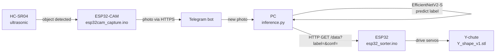

# Fruit Sorter

AI-powered fruit sorting machine. An **ESP32-CAM** watches for fruit with an ultrasonic
sensor, snaps a photo, and sends it to a Telegram bot. A PC picks up the photo, classifies
it with a **PyTorch EfficientNetV2-S** model (`damaged` / `old` / `ripe` / `unripe`), and
tells a second **ESP32** to drive servo gates that drop the fruit into the correct bin
through a 3D-printed Y-chute.

---

## How it works



**Sorting logic** (`esp32_sorter.ino`):

| Prediction        | Action    | Bin        |
|-------------------|-----------|------------|
| `old`, `damaged`  | Servo 1   | reject     |
| `ripe`, `unripe`  | Servo 2   | keep       |

> All three parts — ESP32-CAM, ESP32, and the PC running `inference.py` — must be on the
> **same Wi-Fi network**.

---

## Repository layout

```
fruit-sorter/
├── firmware/
│   ├── esp32cam_capture/      # AI-Thinker ESP32-CAM: ultrasonic trigger + photo -> Telegram
│   │   └── esp32cam_capture.ino
│   └── esp32_sorter/          # ESP32: receives label over HTTP, drives sorting servos
│       └── esp32_sorter.ino
├── ml/
│   ├── train.py               # PyTorch EfficientNetV2-S trainer (produces the .pth used below)
│   ├── inference.py           # Telegram listener + classifier + sends result to the sorter ESP32
│   ├── train_tf_mobilenet.py  # ALTERNATE trainer (TensorFlow/MobileNetV2) — see "Known gaps"
│   ├── requirements.txt       # main pipeline deps (PyTorch)
│   └── requirements-tf.txt    # only for the alternate TF trainer
├── hardware/
│   ├── wiring_diagram.png     # HC-SR04 <-> ESP32-CAM wiring
│   └── Y_shape_v1.stl         # 3D-printable sorting chute
├── LICENSE
└── README.md
```

---

## Wiring

HC-SR04 → ESP32-CAM (pins per `esp32cam_capture.ino`):

| HC-SR04 | ESP32-CAM |
|---------|-----------|
| VCC     | 5V        |
| TRIG    | GPIO 12   |
| ECHO    | GPIO 14   |
| GND     | GND       |

Sorting servos → ESP32 (pins per `esp32_sorter.ino`):

| Servo   | ESP32     |
|---------|-----------|
| Servo 1 | GPIO 18   |
| Servo 2 | GPIO 19   |

> ⚠️ **ECHO is 5V logic, the ESP32 GPIO is 3.3V.** Put a divider on the ECHO line
> (e.g. 1kΩ + 2kΩ) or a level shifter so you don't stress the pin over time.

---

## Setup

### 1. Train the model (optional — only if you don't already have a `.pth`)

Arrange your images as an `ImageFolder`, one sub-folder per class:

```
dataset/
├── damaged/
├── old/
├── ripe/
└── unripe/
```

```bash
cd ml
pip install -r requirements.txt
python train.py --data ./dataset --epochs 15 --out fruit_efficientnetv2s.pth
```

This saves a checkpoint `inference.py` can load directly
(`{"model_state_dict": ..., "classes": [...]}`).

### 2. Flash the firmware (Arduino IDE)

Open each sketch from its own folder and fill in the blanks at the top:

- `firmware/esp32cam_capture/esp32cam_capture.ino` — Wi-Fi SSID/password, `BOTtoken`, `CHAT_ID`.
  Board: **AI Thinker ESP32-CAM**. Needs the `esp32` board package.
- `firmware/esp32_sorter/esp32_sorter.ino` — Wi-Fi SSID/password.
  Needs the **ESP32Servo** library. Note the local IP it prints on boot.

### 3. Run inference on the PC

```bash
cd ml
pip install -r requirements.txt
```

Fill in the config block at the top of `inference.py`:

- `api_id`, `api_hash` — from https://my.telegram.org
- `BOT_USERNAME` — your bot's username
- `MODEL_PATH` — path to your `.pth`
- `SAVE_DIR` — where incoming photos get saved
- `ESP32_IP` — the IP printed by `esp32_sorter.ino`

```bash
python inference.py
```

It listens for photos from your bot, classifies each one, and forwards the result to the
sorter ESP32.

---

## Known gaps / TODO

- **Two training scripts, two frameworks.** `train.py` is PyTorch (EfficientNetV2-S) and
  matches `inference.py`. `train_tf_mobilenet.py` is TensorFlow (MobileNetV2) and saves a
  `.h5` that **`inference.py` cannot load as-is** — it's kept as a reference/alternate only.
  If you want the TF path to be end-to-end, you'd need a matching TF inference script or an
  `.h5 → PyTorch` conversion. Use `train.py` for the working loop.
- **Secrets are placeholders.** Don't commit real Telegram/Wi-Fi credentials. The
  `.gitignore` already excludes the Telethon `*.session` file (it holds a login token for
  your Telegram account) and model weights.
- **Distance window is 1–5 cm** in `esp32cam_capture.ino` — tune `getDistance()` thresholds
  to your rig's geometry.
- **Model weights aren't included.** They're gitignored (large binaries). Ship them via a
  GitHub Release or Git LFS if you want them in the repo.

---

## License

MIT — see [LICENSE](LICENSE).
